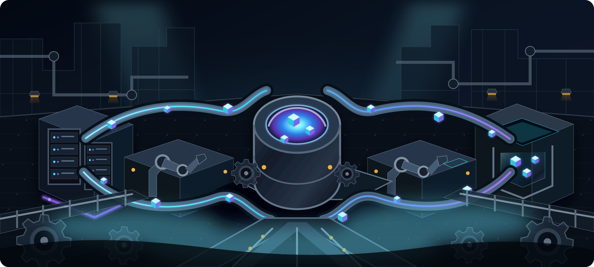
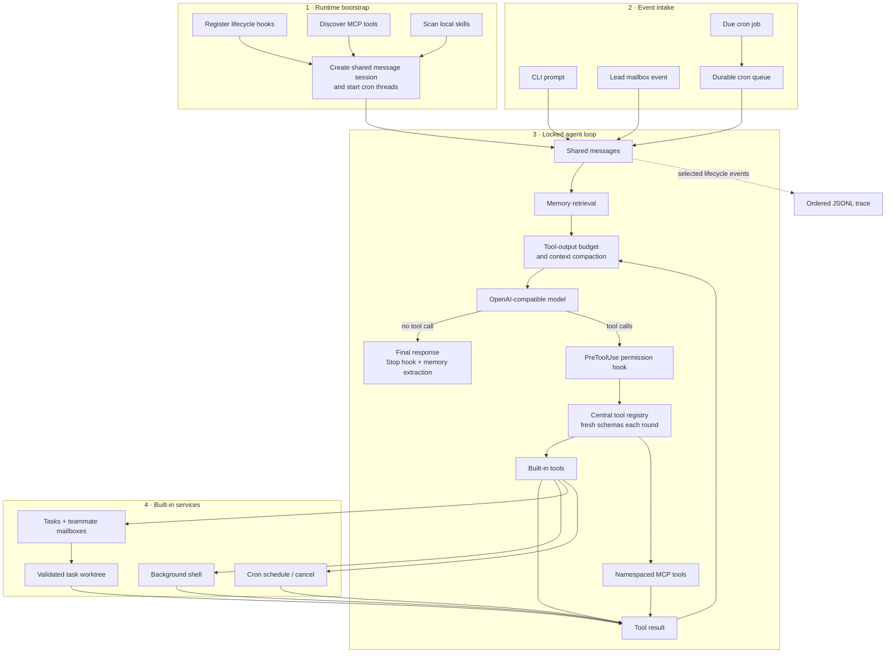

<div align="right">

**[English](README.md) | [简体中文](README.zh-CN.md)**

</div>

# BareLoop

**A transparent, OpenAI-compatible agent runtime built from first principles.**

[](pyproject.toml)
[](pyproject.toml)
[](#project-status)
[](LICENSE)
[](https://github.com/OpenLucasKaka/bareloop/issues)



BareLoop is a compact coding-agent runtime that keeps the model/tool/result loop in plain
Python. Instead of hiding orchestration behind a framework, it exposes tool dispatch,
permissions, context management, memory, scheduling, multi-agent coordination, and tracing as
readable modules you can inspect and change.

> [!WARNING]
> BareLoop `0.1.0` is a pre-alpha learning and experimentation project. Its APIs and persisted
> state formats may change, and it is not ready for production workloads.

## Why BareLoop?

- **Visible control flow.** The core loop fits in one module and follows a direct
  `prompt → model → tool → result` cycle.
- **Provider flexibility.** Model calls use the OpenAI client and can target compatible API
  endpoints through `BASE_URL`.
- **Host-owned behavior.** Tools, permission hooks, memory, background jobs, and context limits
  stay under application control.
- **Composable coordination.** Tasks, teammates, message mailboxes, plan gates, and Git worktrees
  are separate building blocks rather than hidden runtime behavior.
- **Local observability.** Ordered JSONL traces make selected user and runtime events inspectable.

## Capability map

| Area | State | Current capability |
| --- | --- | --- |
| Agent loop | Implemented | OpenAI-compatible chat completions with iterative tool calls |
| Tools | Implemented | Schema-validated registry, scoped dispatch, and schemas refreshed after dynamic registration |
| Workspace boundary | Implemented | Filesystem path containment relative to the active working directory |
| Planning | Implemented | Durable tasks with dependencies, atomic claims, ownership, and assignment leases |
| Isolation | Implemented | Task-bound Git worktrees with registry validation, lease-checked CWD routing, and rollback |
| MCP | Implemented | Streamable HTTP discovery, namespaced tools, local/remote fallback, and dynamic registration |
| Tracing | Implemented | Thread-safe JSONL writer for selected runtime events |
| Hooks | Experimental | Hook registry with default pre-prompt, pre-tool, and stop callbacks |
| Context | Experimental | Tool-output budgeting, micro-compaction, transcripts, and LLM summaries |
| Memory | Experimental | Markdown memories, relevance selection, extraction, and consolidation |
| Async work | Experimental | Background shell execution with later result injection |
| Agent teams | Experimental | Teammates, JSONL mailboxes, plan review, and shutdown protocol |
| Skills | Experimental | Discovery and on-demand loading from `.bareloop/skills/` |
| Scheduling | Experimental | Validated five-field cron, durable queueing, shared-session delivery, and acknowledge/retry handling |
| Goal/session runtime | In progress | State models exist, but the public session lifecycle is unfinished |

## How it works



Startup registers hooks, discovers and dynamically registers MCP tools, scans local skills, creates
one shared message session, and starts the cron poller and queue processor. CLI input, Lead mailbox
events, and due cron prompts all enter that session under the same agent lock. Each turn retrieves
relevant memories, budgets tool output, compacts context when needed, and calls the configured model.
Tool calls pass through the permission hook and the current central registry; built-in and MCP results
then return to the next model round. Selected lifecycle events are written to ordered JSONL traces.

## Quick start

### Requirements

- macOS or another Unix-like system (`fcntl` is currently used by task locking)
- Python 3.12 or newer
- [uv](https://docs.astral.sh/uv/)
- An OpenAI-compatible API endpoint and a tokenizer available to Transformers

Durable memory additionally requires the configured endpoint/model to support
strict function calling with named `tool_choice` and Structured Outputs using
`response_format: {type: json_schema}`. If those capabilities are unavailable,
the agent loop continues but the affected memory extraction or consolidation is
skipped with a visible error; it never falls back to parsing free-form output.

### Install

```bash
git clone https://github.com/OpenLucasKaka/bareloop.git
cd bareloop
uv sync
cp .env.example .env
```

Set at least these values in `.env`:

```dotenv
API_KEY=your-api-key
BASE_URL=https://your-openai-compatible-endpoint/v1
PRIMARY_MODEL=your-chat-model
TOKENIZER_MODEL=your-transformers-tokenizer
```

Keep `.env` local. It is ignored by Git; `.env.example` documents the supported keys.

### Run the agent

```bash
uv run python -m bareloop.mian
```

Press `Enter` to send, `Esc` + `Enter` or `Ctrl` + `J` to insert a newline, and enter `q`,
`quit`, or `exit` to stop.

### Run interactively in PyCharm

BareLoop uses `prompt_toolkit`, so its Run console needs terminal emulation for interactive input and
multiline key bindings to work correctly. Open **Run → Edit Configurations**, add or edit a **Python**
configuration, and use:

- **Module name:** `bareloop.mian`
- **Working directory:** the repository root
- **Python interpreter:** the project's `.venv/bin/python`
- **Environment files:** `.env`

Then open **Modify options** and enable **Emulate terminal in output console**. See the
[PyCharm Python run configuration documentation](https://www.jetbrains.com/help/pycharm/run-debug-configuration-python.html)
for the corresponding IDE option.

### Run the bundled MCP demo (optional)

Start the server in a second terminal:

```bash
uv run python -m bareloop.mcp_integration.server
```

It exposes `add` and `current_time` at `http://127.0.0.1:8000/mcp`. BareLoop attempts the local
endpoint first, then `MCP_REMOTE_URL` when configured. Discovered tools are registered with names
such as `mcp__demo__add`. If no endpoint is reachable, startup continues without MCP tools. A remote
endpoint carrying `MCP_REMOTE_TOKEN` must use HTTPS; loopback HTTP remains available for local use.

## Configuration

| Variable | Required | Purpose |
| --- | --- | --- |
| `API_KEY` | Usually | Credential sent to the OpenAI-compatible provider |
| `BASE_URL` | No | Custom provider API base URL; omit when using the SDK default |
| `PRIMARY_MODEL` | Yes | Model used by the main loop and memory operations |
| `TOKENIZER_MODEL` | Yes | Transformers tokenizer used to estimate context size |
| `FALLBACK_MODEL` | No | Reserved fallback model identifier |
| `CODE_MODEL` | No | Reserved coding model identifier |
| `MLX_MODEL` | No | Reserved local MLX model identifier |
| `MCP_LOCAL_URL` | No | Local MCP URL; defaults to `http://127.0.0.1:8000/mcp` |
| `MCP_REMOTE_URL` | No | Remote MCP fallback URL |
| `MCP_REMOTE_TOKEN` | No | Bearer token for the remote MCP endpoint |
| `MCP_HOST` | No | Bundled MCP server bind host; defaults to `127.0.0.1` |
| `MCP_PORT` | No | Bundled MCP server port; defaults to `8000` |

## Project layout

```text
src/bareloop/
├── mian.py              # CLI bootstrap and shared runtime session
├── loop.py              # Core model/tool/result loop
├── tools/               # Tool schemas, registry, dispatcher, and built-ins
├── hook/                # Permission and lifecycle hooks
├── compact/             # Context and large-output management
├── memory/              # Durable Markdown memory
├── task_system/         # Dependency-aware durable tasks
├── agent_team/          # Teammates, mailboxes, plans, and coordination
├── worktree/            # Task-bound Git worktree isolation
├── cron_scheduler/      # Durable scheduled prompts
├── mcp_integration/     # MCP client discovery and demo server
├── background_system/   # Background command execution
├── skills/              # Local skill discovery and loading
└── trace/               # Ordered JSONL tracing
```

Runtime state is written under `.bareloop/` and is intentionally excluded from Git.

## Development

```bash
uv sync
uv run pytest
uv run ruff check .
uv run ruff format --check .
uv build
```

The current test suite covers tool schemas and dispatch, tasks, team protocols, worktrees, MCP
integration, runtime helpers, and trace ordering. It does not replace live-provider or full CLI
end-to-end testing.

## Project status

Version `0.1.0` establishes the experimental runtime surface. The core loop and most supporting
modules exist, including shared-session cron delivery with retry handling. Goal/session orchestration,
complete event tracing, cross-platform support, and public API stability are still in progress. See
the source and tests as the current contract.

## License

BareLoop is released under the [MIT License](LICENSE).
