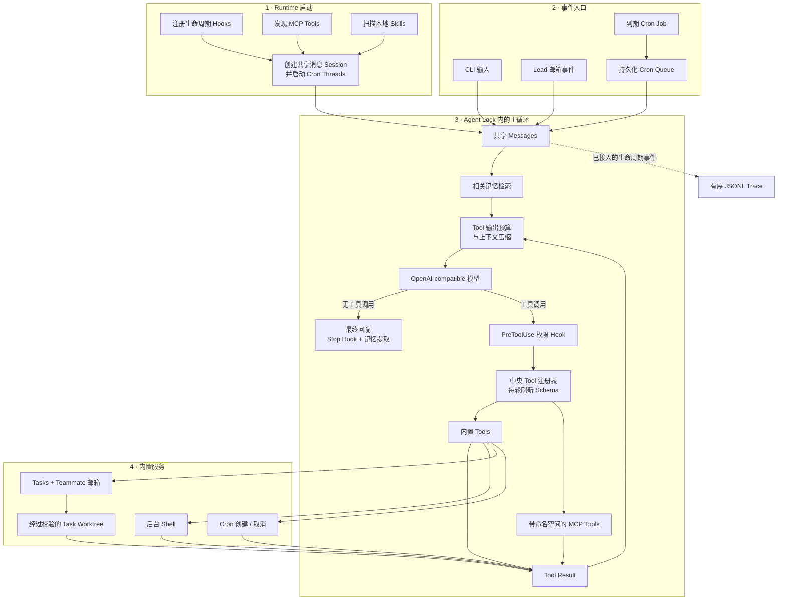

<div align="right">

**[English](README.md) | [简体中文](README.zh-CN.md)**

</div>

# BareLoop

**一个从基本原理出发、流程透明、兼容 OpenAI API 的 Agent Runtime。**

[](pyproject.toml)
[](pyproject.toml)
[](#项目状态)
[](LICENSE)
[](https://github.com/OpenLucasKaka/bareloop/issues)


BareLoop 是一个紧凑的 Coding Agent Runtime，使用清晰的 Python 代码实现
`model → tool → result` 循环。它不把编排逻辑藏在大型框架后面，而是把工具调度、权限、
上下文管理、记忆、调度、多 Agent 协作和追踪拆成可阅读、可修改的独立模块。

> [!WARNING]
> BareLoop `0.1.0` 是处于 Pre-Alpha 阶段的学习与实验项目。API 和持久化格式可能变化，
> 目前不适合生产环境。

## 为什么选择 BareLoop？

- **流程可见。** 核心循环集中在一个模块中，直接呈现 `prompt → model → tool → result`。
- **Provider 可替换。** 模型调用基于 OpenAI SDK，可通过 `BASE_URL` 接入兼容接口。
- **行为由 Host 控制。** 工具、权限 Hook、记忆、后台任务和上下文限制都留在应用侧。
- **协作能力可组合。** Task、Teammate、消息邮箱、Plan Gate 和 Git Worktree 都是独立构件。
- **本地可观测。** 有序 JSONL Trace 记录已接入的用户事件和 Runtime 事件，便于检查。

## 能力地图

| 模块 | 状态 | 当前能力 |
| --- | --- | --- |
| Agent Loop | 已实现 | 兼容 OpenAI Chat Completions 的多轮工具调用 |
| Tools | 已实现 | Schema 校验、Scope 调度，并在动态注册后刷新模型侧 Tool Schema |
| Workspace 边界 | 已实现 | 文件操作限制在当前工作目录内，阻止路径逃逸 |
| Task Planning | 已实现 | 持久化依赖、原子领取、Owner 绑定与 Assignment Lease |
| Worktree 隔离 | 已实现 | Task 绑定 Git Worktree、注册校验、Lease CWD 路由及失败回滚 |
| MCP | 已实现 | Streamable HTTP 发现、工具命名空间、本地/远程降级与动态注册 |
| Trace | 已实现 | 为已接入事件提供线程安全的 JSONL Writer |
| Hooks | 实验性 | Hook 注册表及默认 Pre-Prompt、Pre-Tool、Stop 回调 |
| Context | 实验性 | 工具输出预算、微压缩、Transcript 和 LLM 摘要 |
| Memory | 实验性 | Markdown 记忆、相关性选择、提取与合并 |
| 后台任务 | 实验性 | 后台执行 Shell，并在后续循环注入结果 |
| Agent Team | 实验性 | Teammate、JSONL 邮箱、Plan Review 与关闭协议 |
| Skills | 实验性 | 从 `.bareloop/skills/` 发现并按需加载 Skill |
| Cron | 实验性 | 五段表达式校验、持久化队列、共享 Session 投递及确认/重试处理 |
| Goal/Session | 开发中 | 已有状态模型，公开 Session 生命周期尚未完成 |

## 整体运行流程



Runtime 启动时注册 Hooks、发现并动态注册 MCP Tools、扫描本地 Skills、创建共享消息
Session，同时启动 Cron Poller 和 Queue Processor。CLI 输入、Lead 邮箱事件与到期 Cron
Prompt 都在同一个 Agent Lock 下进入该 Session。每轮先检索相关记忆、控制 Tool 输出体积
并按需压缩上下文，再调用配置好的模型。工具调用经过权限 Hook 和当前中央注册表，内置与
MCP Tool 的结果随后返回下一轮模型调用；已接入的生命周期事件会写入有序 JSONL Trace。

## 快速开始

### 环境要求

- macOS 或其他 Unix-like 系统（Task Lock 当前依赖 `fcntl`）
- Python 3.12 或更高版本
- [uv](https://docs.astral.sh/uv/)
- 一个兼容 OpenAI API 的模型服务，以及 Transformers 可加载的 Tokenizer

### 安装

```bash
git clone https://github.com/OpenLucasKaka/bareloop.git
cd bareloop
uv sync
cp .env.example .env
```

至少在 `.env` 中填写：

```dotenv
API_KEY=your-api-key
BASE_URL=https://your-openai-compatible-endpoint/v1
PRIMARY_MODEL=your-chat-model
TOKENIZER_MODEL=your-transformers-tokenizer
```

请只在本地保存 `.env`。Git 已忽略该文件；支持的配置项记录在 `.env.example` 中。

### 运行 Agent

```bash
uv run python -m bareloop.mian
```

按 `Enter` 发送，按 `Esc` + `Enter` 或 `Ctrl` + `J` 插入换行；输入 `q`、`quit` 或
`exit` 退出。

### 在 PyCharm 中交互运行

BareLoop 使用 `prompt_toolkit`，因此 Run Console 需要模拟终端，交互输入和多行快捷键才能
正常工作。打开 **Run → Edit Configurations**，新增或编辑一个 **Python** 配置，并设置：

- **Module name：** `bareloop.mian`
- **Working directory：** 项目根目录
- **Python interpreter：** 项目中的 `.venv/bin/python`
- **Environment files：** `.env`

随后打开 **Modify options**，勾选 **Emulate terminal in output console**。对应 IDE 选项可参考
[PyCharm Python Run Configuration 官方文档](https://www.jetbrains.com/help/pycharm/run-debug-configuration-python.html)。

### 运行内置 MCP Demo（可选）

在另一个终端启动：

```bash
uv run python -m bareloop.mcp_integration.server
```

服务默认位于 `http://127.0.0.1:8000/mcp`，提供 `add` 和 `current_time` 两个工具。
BareLoop 先尝试本地地址，再尝试配置的 `MCP_REMOTE_URL`；发现的工具会以
`mcp__demo__add` 这类名称动态注册。两者都不可达时会降级启动，不会因为 MCP 缺失而退出。
携带 `MCP_REMOTE_TOKEN` 的远程地址必须使用 HTTPS，本地 Loopback 地址仍可使用 HTTP。

## 配置

| 变量 | 必需 | 用途 |
| --- | --- | --- |
| `API_KEY` | 通常需要 | OpenAI-compatible Provider 凭据 |
| `BASE_URL` | 否 | 自定义 Provider API 地址；使用 SDK 默认地址时可省略 |
| `PRIMARY_MODEL` | 是 | 主循环和记忆操作使用的模型 |
| `TOKENIZER_MODEL` | 是 | Transformers Tokenizer，用于估算上下文大小 |
| `FALLBACK_MODEL` | 否 | 预留的 Fallback Model 标识，目前未接入路由 |
| `CODE_MODEL` | 否 | 预留的 Coding Model 标识，目前未接入路由 |
| `MLX_MODEL` | 否 | 预留的本地 MLX Model 标识，目前未接入路由 |
| `MCP_LOCAL_URL` | 否 | 本地 MCP 地址，默认 `http://127.0.0.1:8000/mcp` |
| `MCP_REMOTE_URL` | 否 | 远程 MCP 备用地址 |
| `MCP_REMOTE_TOKEN` | 否 | 远程 MCP Bearer Token |
| `MCP_HOST` | 否 | 内置 MCP Server Host，默认 `127.0.0.1` |
| `MCP_PORT` | 否 | 内置 MCP Server Port，默认 `8000` |

## 项目结构

```text
src/bareloop/
├── mian.py              # CLI 启动与共享 Runtime Session
├── loop.py              # 核心 Model/Tool/Result 循环
├── tools/               # Tool Schema、注册表、调度器和内置工具
├── hook/                # 权限与生命周期 Hooks
├── compact/             # 上下文与大型输出管理
├── memory/              # 持久化 Markdown Memory
├── task_system/         # 支持依赖关系的持久化 Tasks
├── agent_team/          # Teammates、邮箱、Plans 和协作协议
├── worktree/            # Task 绑定的 Git Worktree 隔离
├── cron_scheduler/      # 持久化定时 Prompt（开发中）
├── mcp_integration/     # MCP Client 发现与 Demo Server
├── background_system/   # 后台命令执行
├── skills/              # 本地 Skill 发现与加载
└── trace/               # 有序 JSONL Trace
```

Runtime 状态统一写入 `.bareloop/`，并排除在 Git 版本控制之外。

## 开发与验证

```bash
uv sync
uv run pytest
uv run ruff check .
uv run ruff format --check .
uv build
```

当前测试覆盖 Tool Schema 与调度、Tasks、Team 协议、Worktree、MCP 集成、Runtime Helper
以及 Trace 顺序；真实在线模型和完整 CLI 仍需要额外的端到端验证。

## 项目状态

`0.1.0` 建立了实验性 Runtime 的基础界面。核心循环和大部分支撑模块已经存在，其中包括
共享 Session 下带重试处理的 Cron 投递。Goal/Session 编排、完整事件追踪、跨平台支持及
Public API 稳定性仍在开发中。现阶段请以源码和测试作为行为契约。

## License

BareLoop 使用 [MIT License](LICENSE)。
